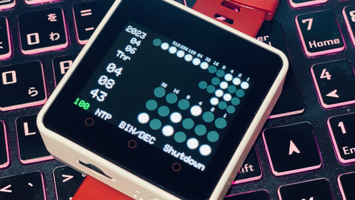

# Basic Binary Watch on M5Stack (Core2)

 

## Overview

M5Stack Core2 用 バイナリウォッチです。 
年・月・日・曜日・時・分・秒 を全部バイナリ(円形の点灯/消灯による2進数)で表示します。 
(曜日は0が日曜、6が土曜)

バイナリ表示には小さい10進数の数字をガイドとして表示しております。 
点灯箇所のガイド値を足すと、各値が分かります。 
画面をタッチすると10進数の時刻が表示されるので、暗算の答え合わせができます。

Wi-FiにてNTPサーバへ接続し、時刻同期が可能です。 
バッテリ節約のためのオートオフも可能です。

**お断り： 
RTCを内蔵しているCore2での動作検証のみ確認済みです。 
他モデルでの動作は未確認です、ご了承ください。**

余談ですがM5Stack様公式ストアにて販売されている Development Board Watch Kit は、大変おすすめの品でございます。 
ご参考まで。

 

開発環境： Ubuntu 22.04 LTS

## Usage

ファイルをダウンロードして、 
`basic_binary_watch.ino` を Arduino IDE にて書き込みください。

インタフェース | 操作        | アクション
---------------|-------------|--------------------------------
BtnA           | 500ms長押し | Wi-Fi・NTPサーバ接続
BtnB or 画面   | クリック     | 10進数の答え合わせを表示/非表示
BtnC           | 500ms長押し | 終了

 

## Customize

`basic_binary_watch.ino` の14〜52行内にて設定可能です。

- NTP同期時に接続するWi-FiのSSID
- NTP同期時に接続するWi-Fiのpw
- デフォルトでデシマルを表示する/しない設定
- 背景色
- 文字色(バッテリ以外)
- バイナリ表示のフチの色
- バイナリ表示オフの色
- バイナリ表示オンの色
- バッテリ表示の各文字色
- 自動終了するまでの時間(秒) 
  *※ 0で自動終了自体を無効にできます*
- BtnC押下時・または一定秒間操作がなかったときに、powerOffまたはdeepSleepする設定 
  *※ お好みです。再度起動するときに電源ボタンを押す操作は同じです*

 

## Change Log

Version | Detail
--------|------------------------------
0.1.1   | 修正:バッテリ表示の文字色バグ
0.1.0   | 公開
